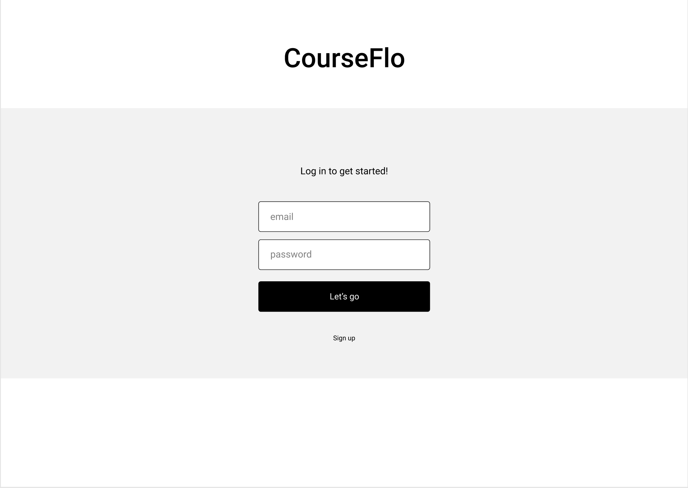
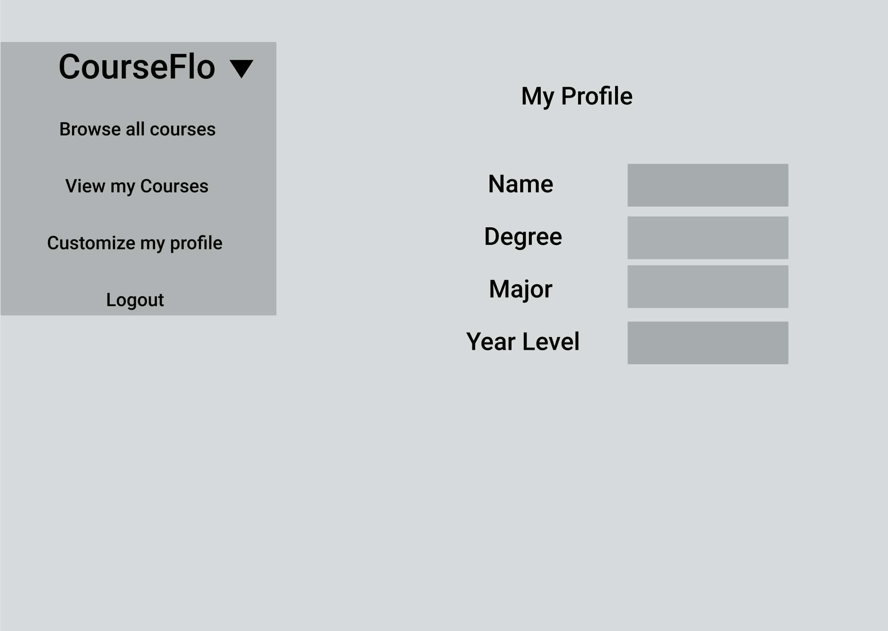
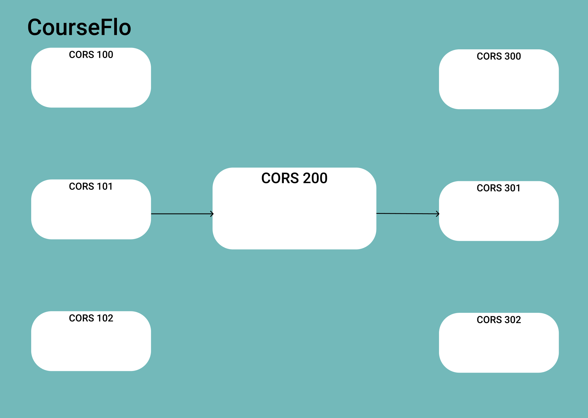

CoursefFlo (subject to name change) is a webapp designed to help students see the required pre-req and co-req’s that they need before graduation in a visually pleasing manner, and allows users to explore their degree programs to better understand their options. It will store data in the form of user login, preferences, saved courses, and recent searches; we will be scraping and storing all the SSC course data, every time it is updated by UBC. Our additional functionalities that we could add or remove are: a complete API system to scrape and parse SSC data as a standalone repository, a visualizer that can display courses in 3d, and a recommender system that can give suggestions towards where we can take further courses in the future.

Team: [Sepand](https://github.com/DSep), [Sam](https://github.com/sam-ip), [Brandon](https://github.com/beetai), [Guanting](https://github.com/baconandchips).

*   Project Description:
    *   Who is it for? Students
    *   What will it do? (What "human activity" will it support?) We have the following user stories:
        *   As a user, I want to be able to create an account to store my info: (name, email, course schedule, recent searches);
        *   As a user, I want to be able to browse and save my courses (based off course schedule); and
        *   As a user, I want to be able to browse courses, choosing to visualize them in a tree, connected to their pre-reqs coreqs.
    *   What type of data will it store?
        *   User login, prefs, saved courses, recent searches
        *   We scrape and store all the SSC course data, every time it is updated by UBC
        *   The user can access this in a beautified format
    *   What will users be able to do with this data?
        *   See the required pre-req/co-req’s that they may need before graduation in a visually pleasing manner
        *   Explore degree programs, for users such as prospective students, to understand their options and 
    *   What is some additional functionality you can add/remove based on time constraints?

*   Project task requirements:
    *      3-5 minimal requirements (will definitely complete)
        *   Backend: just call [https://ubcexplorer.io/api](https://ubcexplorer.io/api)
            *   As a minimal requirement, we will be using the ubc explorer api. May eventually aim to use our own scraper
        *   FrontEnd/React: 
            *   We have Login/Signup Pages
            *   We have a Visualizer page
            *   Webpages can display text, images and/or tables to users
        *   Database:
            *   Can store simple course data for frontend.
    *      3-7 "standard" requirements (will most likely complete)
        *   Backend: 
            *   Backend retrieves and updates user data as needed
            *   Backend retrieves course data as queried or selected on frontend
            *   User data endpoint, potentially coupled with OAuth login
        *   Frontend: 
            *   Visualizer page displays the selected course of the user in a 2D way.
            *   Basic course search
            *   Personalization of courses to the user (user profile)
        *   Database: 
            *   Store user’s ‘starred’ courses, store their degree program, recent searches
            *   Can store simple course data for frontend.
    *      2-3 stretch requirements (plan to complete 1!)
        *   Backend:
            *   Modify [existing scraper](https://github.com/eyqs/req) to scrape data from UBC directly (We should use [the calendar](http://www.calendar.ubc.ca/vancouver/courses.cfm?page=name&code=CPSC) )
            *   Make an API out of our adapted scraper or DB data.
        *   Frontend: 
            *   Visualizer can display the course relationships in 3D
            *   Focus/view course details vs Overview of courses, prereqs, and dependents
        *   Mix (far stretch):
            *   Backend: System can retrieve degree programs, allowing users to view listings of full degree programs
            *   Frontend: System can visualize the full course listing of the degree, allowing you to explore each course node as needed to see further req details
            *   Backend: Recommend courses to add to their degree program, based on need and what you’ve taken
            *   Backend: Recommend courses to add based on what courses you’ve taken (exploratory)

*   Breakdown of 2 minimum requirements into ~2-5 smaller tasks:
    *   Backend: 
        *   Complete an analysis and hacky test of the current ubcexplorer.io API, to figure out the data structure
        *   Parse and organize the data in a way that allows fast access
        *   Create an algorithm that, given a course, can find all the courses that it requires (recursively)
        *   Display that list in a simple text format
    *   FrontEnd: 
        *   Choose UI library for components in React
        *   Individual pages with navigation between them
        *   Actions (login, signup, add/delete courses, **visualize courses**, db querying/storing for each of the pages)

<!-- Here are some basic wireframes/prototype sketches:

 -->
